```{r}
#| label: setup
#| include: false
source("scripts.R")
```

## About Me {.light-centered .center style="font-size: 30px; line-height: 1.5;"}

::: {.columns}
::: {.column width="34%"}

:::

::: {.column width="66%"}
- **Pingfan Hu**, PhD Candidate at George Washington University, advised by Dr. John Helveston.

- Research interests:
  <div style="margin-left: 1em; line-height: 1;">
    1. **Data Science** in transportation systems and human behavior
    2. **Open-Source Software** in <svg xmlns="http://www.w3.org/2000/svg" viewBox="0 0 581 512" aria-label="R" style="height: 0.85em; vertical-align: -0.1em; fill: currentColor;"><!-- Font Awesome Free r-project icon (CC BY 4.0) --><path d="M581 226.6C581 119.1 450.9 32 290.5 32S0 119.1 0 226.6C0 322.4 103.3 402 239.4 418.1V480h99.1v-61.5c24.3-2.7 47.6-7.4 69.4-13.9L448 480h112l-67.4-113.7c54.5-35.4 88.4-84.9 88.4-139.7zm-466.8 14.5c0-73.5 98.9-133 220.8-133s211.9 40.7 211.9 133c0 50.1-26.5 85-70.3 106.4-2.4-1.6-4.7-2.9-6.4-3.7-10.2-5.2-27.8-10.5-27.8-10.5s86.6-6.4 86.6-92.7-90.6-87.9-90.6-87.9h-199V361c-74.1-21.5-125.2-67.1-125.2-119.9zm225.1 38.3v-55.6c57.8 0 87.8-6.8 87.8 27.3 0 36.5-38.2 28.3-87.8 28.3zm-.9 72.5H365c10.8 0 18.9 11.7 24 19.2-16.1 1.9-33 2.8-50.6 2.9v-22.1z"/></svg> tools for survey research
    3. **Agentic AI Engineering** around Claude Code
  </div>

- For more information, visit [**pingfan.org**](https://pingfan.org)
:::
:::

## I try to figure out what people want... {.black-centered .center}

{fig-align="center" width=500}

## {.dark-centered .center}

::: {.column width="20%"}
::: {layout="[[-1], [1], [-1]]"}
{fig-align="center" width="80%" .round-image}
:::

Prof. John Helveston

:::

::: {.column .fragment width="80%"}
{width="90%" .purple-border}
:::

## {.light-centered .center}

{fig-align="center" width="85%" .purple-border}

## WYSIWYG Interface {.light-centered .center}

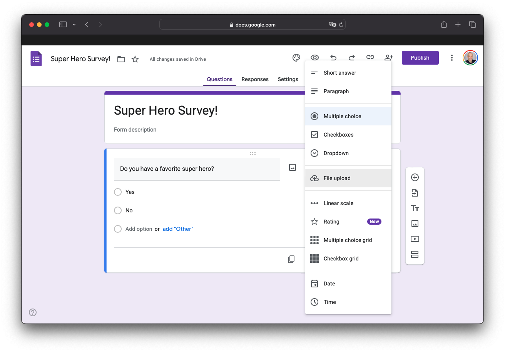{fig-align="center" width="90%"}

## {.light-centered .center}

::: {.column width="70%"}

:::

::: {.column width="30%"}

### Limitations

<br>

::: {style="text-align: left;"}

❌ Reproducibility

::: {.fragment}
❌ Version control
:::
:::
:::

## {.light-centered .center}

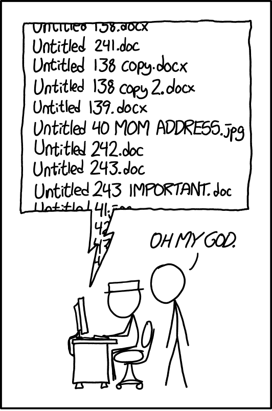{fig-align="center" width="40%"}

## {.light-centered .center}

::: {.column width="70%"}

:::

::: {.column style="width: 30%; text-align: left;"}

### Limitations

<br>

❌ Reproducibility

❌ Version control

❌ Limited features

::: {.fragment}
❌ Open source
:::

:::

## {.dark-centered .center}

::: {.column width="40%"}

<br>
<br>

### Why not make surveys from `code`? 

:::

::: {.column width="10%"}
:::

::: {.column .fragment style="width: 40%; text-align: left;"}

### ~~Limitations~~<br>Features

✅ Reproducibility

✅ Version control

✅ Lots of features

✅ Open source

:::

## Introducing `surveydown`! {.dark-centered .center style="font-size: 1.2em;"}

<br>

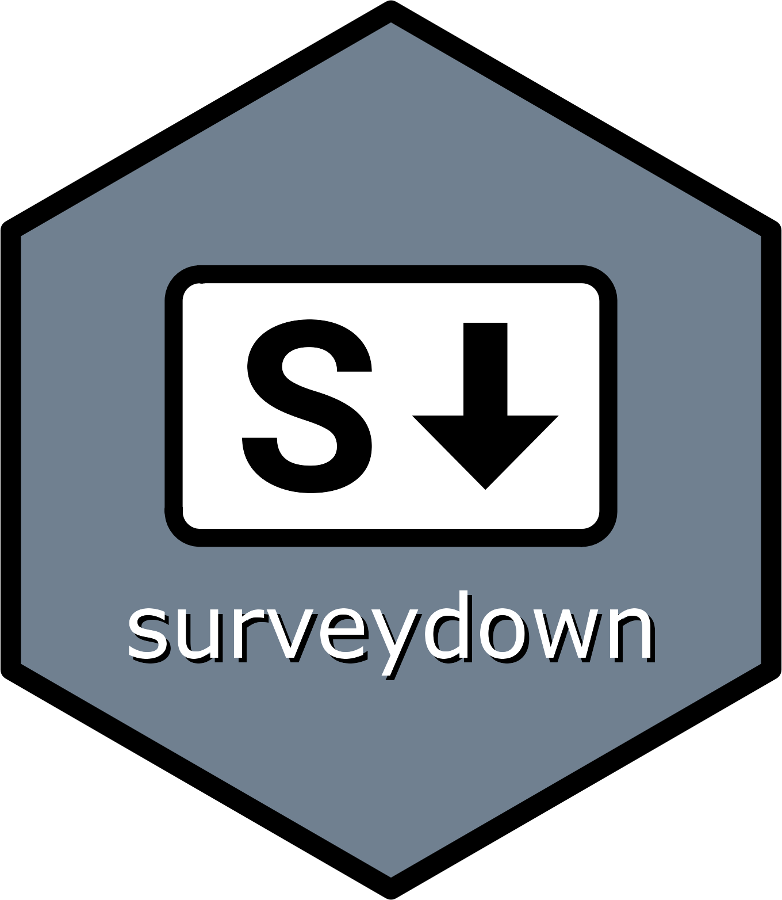{fig-align="center" width=300}

## In this talk, we will cover: {.light-centered .center}

<br>

::: {.grid-container style="height: 40vh;"}
::: {.centered-container style="width: 500px;"}
What is `surveydown`?
:::

::: {.centered-container style="width: 500px;"}
How does it work?
:::

::: {.centered-container style="width: 500px;"}
What can I do with it?
:::

::: {.centered-container style="width: 500px;"}
What's next?
:::
:::

## What is `surveydown`? {.dark-centered .center style="font-size: 1.2em;"}

<br>

{fig-align="center" width=300}

## R package that renders <span style="color: #2C8475;">Quarto</span> files into <span style="color: #2C8475;">surveys</span> {.light-centered .center}

<br>

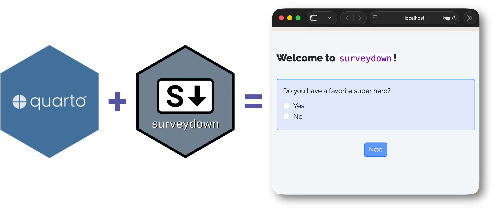{fig-align="center" width=100%}

## <span style="color: #2C8475;">Quarto</span> is a publishing system {.light-centered .center}

<br>

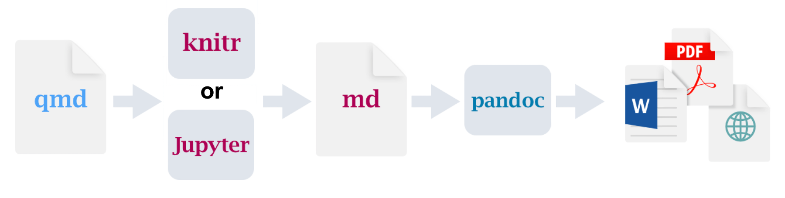{fig-align="center" width=100% .purple-border}

## {style="font-size: 0.7em;" .light-centered .center}

::: {.column width="48%"}

### Original `qmd` file {style="text-align: center;"}

<br>
<br>

::: {style="text-align: center;"}
Markdown + `R code` chunks
:::

```{r}
#| results: 'asis'
quarto_r_html()
```

:::

::: {.column width="4%"}
:::

::: {.column .fragment width="48%"}

### Rendered HTML {style="text-align: center;"}

<br>

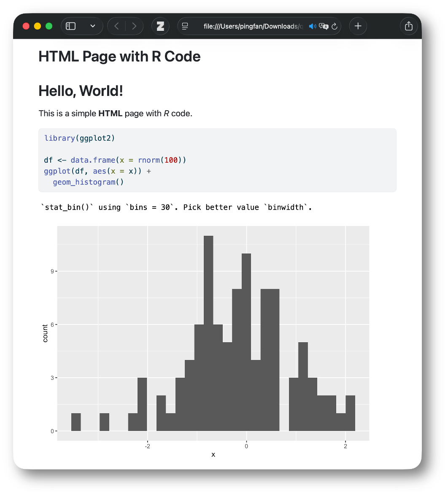{fig-align="center" width=100%}

:::

## {style="font-size: 0.7em;" .light-centered .center}

::: {.column width="48%"}

### Original `qmd` file {style="text-align: center;"}

<br>
<br>

::: {style="text-align: center;"}
Markdown + `Python code` chunks
:::

```{r}
#| results: 'asis'
quarto_python_pdf()
```

:::

::: {.column width="4%"}
:::

::: {.column .fragment width="48%"}

### Rendered PDF {style="text-align: center;"}

<br>

{fig-align="center" width=100%}

:::

## {.light-centered .center}

{width=100%}


## {style="font-size: 0.7em;" .light-centered .center}

::: {.column width="48%"}

### `survey.qmd` {style="text-align: center;"}

```{r}
#| results: 'asis'
surveycode()
```

:::

::: {.column width="4%"}
:::

::: {.column width="48%"}

### Rendered Survey {style="text-align: center;"}

<br>

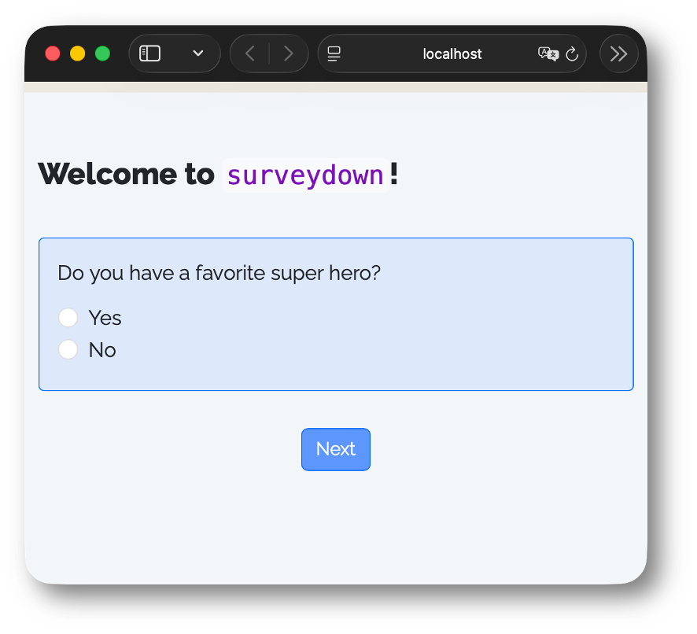{fig-align="center" width=600}

:::

## {style="font-size: 0.7em;" .light-centered .center}

::: {.column width="48%"}

### `survey.qmd` {style="text-align: center;"}

```{r}
#| results: 'asis'
surveycode("1-5")
```

:::

::: {.column width="4%"}
:::

::: {.column width="48%"}

::: {.bubble-left style="display: block; transform: none;"}
YAML header for a "clean" output
:::

:::

## {style="font-size: 0.7em;" .light-centered .center}

::: {.column width="48%"}

### `survey.qmd` {style="text-align: center;"}

```{r}
#| results: 'asis'
surveycode("7-9")
```

:::

::: {.column width="4%"}
:::

::: {.column width="48%"}

::: {.bubble-left style="display: block; transform: none;"}
Load the `surveydown` Package
:::

:::

## {style="font-size: 0.7em;" .light-centered .center}

::: {.column width="48%"}

### `survey.qmd` {style="text-align: center;"}

```{r}
#| results: 'asis'
surveycode("11,29")
```

:::

::: {.column width="4%"}
:::

::: {.column width="48%"}

::: {.bubble-left style="display: block; position: relative; transform: none; text-align: left; width: fit-content; margin-top: 211px;"}
Use triple-dash marker (`---`)

to define survey pages
:::

::: {.fragment .bubble-left style="display: block; position: relative; transform: none; text-align: left; width: fit-content; margin-top: 24px;"}
Quarto fences (`:::`) also OK:

<br>

`::: {#welcome .sd-page}`

<br>

`Page content`

<br>

`:::`
:::

:::

## {style="font-size: 0.7em;" .light-centered .center}

::: {.column width="48%"}

### `survey.qmd` {style="text-align: center;"}

```{r}
#| results: 'asis'
surveycode("13-27")
```

:::

::: {.column width="4%"}
:::

::: {.column width="48%"}

::: {.bubble-left style="display: block; transform: none;"}
Page content

- Markdown for text, images, etc.
- `sd_question()` for survey questions
- `sd_next()` for page navigation
:::

:::

## {style="font-size: 0.7em;" .light-centered .center}

::: {.column width="48%"}

### `survey.qmd` {style="text-align: center;"}

```{r}
#| results: 'asis'
surveycode("1-27")
```

:::

::: {.column width="4%"}
:::

::: {.column width="48%"}

### Rendered Survey {style="text-align: center;"}

<br>

{fig-align="center" width=600}

:::

## {style="font-size: 0.7em;" .light-centered .center}

::: {.column width="48%"}

### `survey.qmd` {style="text-align: center;"}

```{r}
#| results: 'asis'
surveycode("18,20,21,22")
```

:::

::: {.column width="4%"}
:::

::: {.column width="48%"}

### Rendered Survey {style="text-align: center;"}

{fig-align="center" width=600}

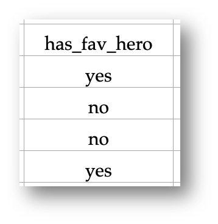{fig-align="center" width=180 style="margin-top: -40px;"}

:::

## Wait a minute...<br>Quarto renders to <span style="color: #FFB84D;">static</span> html pages, right? {.dark-centered .center}

<br>

{fig-align="center" width=40%}

## <span style="color: #FFB84D;">Shiny</span> to the rescue! {.dark-centered .center}

<br>

::: {.column}
{width=300}
:::

::: {.column}
{fig-align="center" width=70%}
:::

## {.light-centered .center}

{width=100%}

## {.light-centered .center}

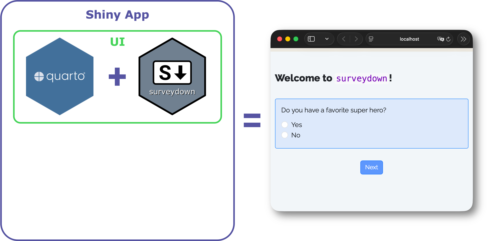{width=100%}

## {.light-centered .center}

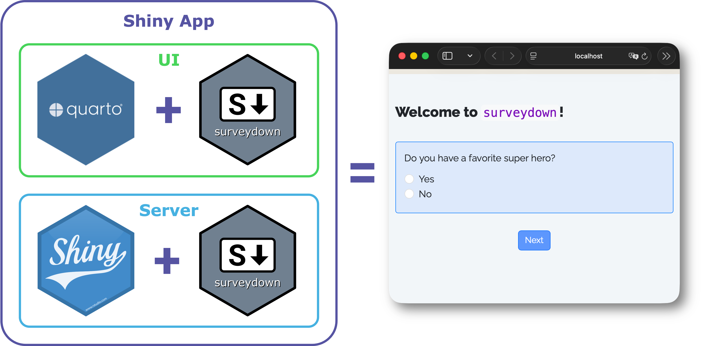{width=100%}

## A complete `surveydown` survey {.light-centered .center}

<br>

::: {.fragment .column style="width: 48%;"}
`survey.qmd`

A **Quarto doc** defining the survey content (pages, text, images, questions, etc.).
:::

::: {.column width="4%"}
:::

::: {.fragment .column style="width: 48%;"}
`app.R`

An **R script** defining the survey Shiny app.
:::

## Don't panic! {.dark-centered .center}

<br>

{width=80% .purple-border}

## {style="font-size: 0.9em;"}

::: {.column width="60%"}

### `app.R` {style="text-align: center;"}

<br>

```{r}
#| results: 'asis'
appcode_short()
```

:::

## {style="font-size: 1em;"}

::: {.column style="width: 60%; font-size: 0.9em;"}

### `app.R` {style="text-align: center;"}

<br>

```{r}
#| results: 'asis'
appcode_short("3,7")
```

:::

::: {.column width="4%"}
:::

::: {.column style="width: 36%; font-size: 0.7em;"}

::: {.bubble-left data-lines="3" style="display: block; transform: none;"}
Render `survey.qmd` as UI
:::

::: {.bubble-left data-lines="7" style="display: block; transform: none;"}
Run the `surveydown` server
:::

:::

## Wait a minute...<br>How do you store the response <span style="color: #FFB84D;">data</span>? {.dark-centered .center}

<br>

{fig-align="center" width=50% .purple-border}

## <span style="color: #FFB84D;">PostgreSQL</span> to the rescue! {.dark-centered .center}

<br>

::: {.column}

<br>

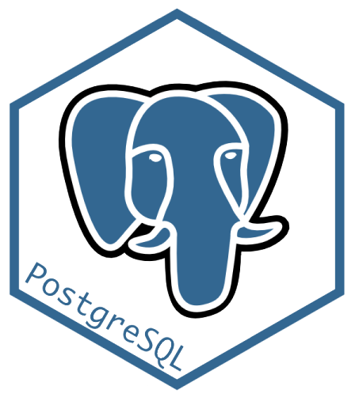{width=300}
:::

::: {.column}
{fig-align="center" width=60% .purple-border}
:::

## [`supabase.com`](https://supabase.com) {.light-centered .center}

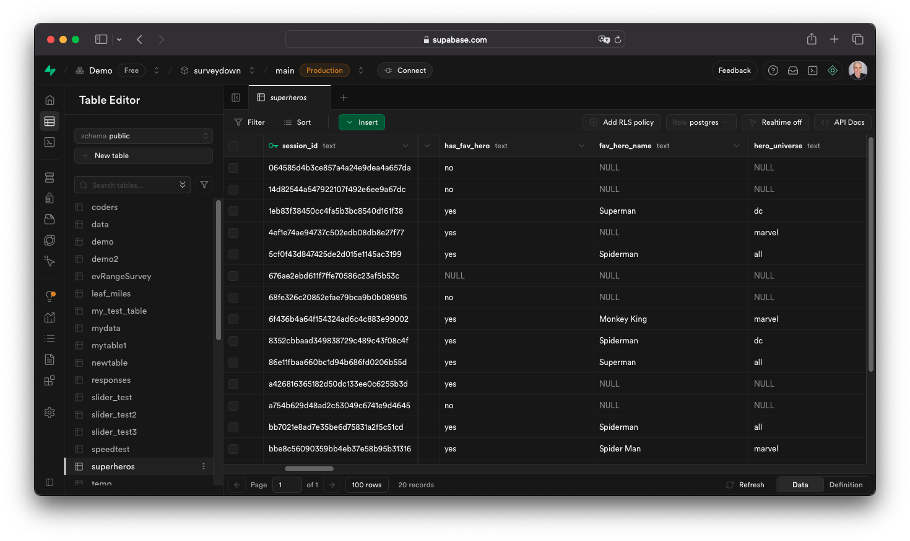{width=100%}


##

::: {.column style="width: 58%; font-size: 0.9em;"}

### `app.R` {style="text-align: center;"}

<br>

```{r}
#| results: 'asis'
appcode_long("3,4,10")
```

:::

::: {.column width="2%"}
:::

::: {.column style="width: 40%; font-size: 0.7em;"}

::: {.bubble-left data-lines="3,4" style="display: block; transform: none;"}
Store credentials

Connect to the database
:::

::: {.bubble-left data-lines="10" style="display: block; transform: none;"}
Pass connection to `sd_server()`
:::

:::

## {.light-centered .center}

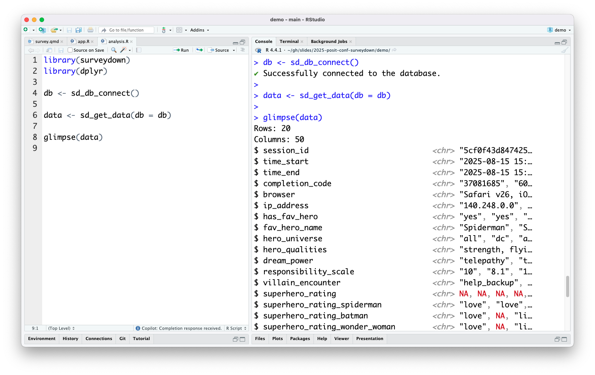{width=100%}

## What is `surveydown`? {.dark-centered .center style="font-size: 1.2em;"}

<br>

{fig-align="center" width=300}

## {.light-centered .center}

{fig-align="center" width=100%}

## What can `surveydown` do? {.dark-centered .center}

## `surveydown` is feature-packed! {.light-centered .center}

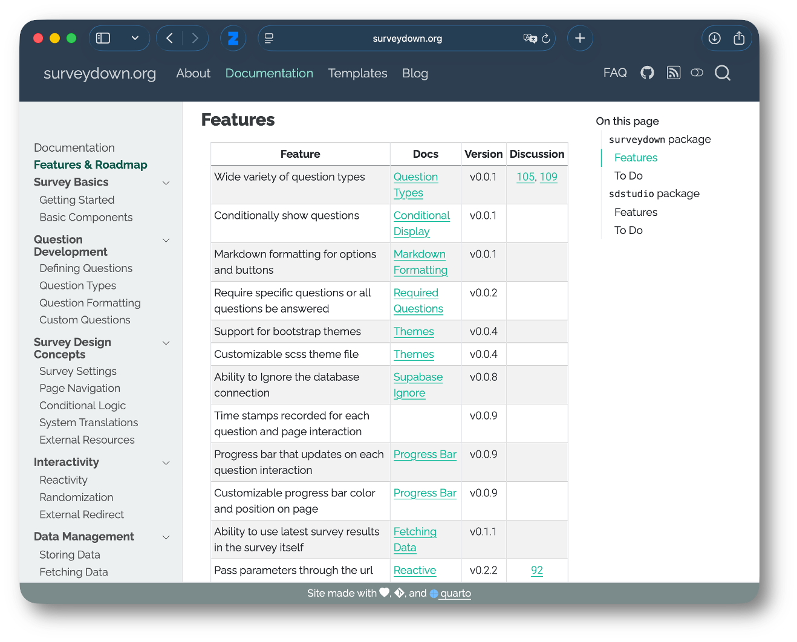{width=75%}

## Feature Highlights {.light-centered .center}

<br>

::: {.grid-container style="height: 20vh;"}
::: {.centered-container style="width: 500px;"}
Question types
:::

::: {.centered-container style="width: 500px;"}
Conditional logic
:::
:::

## 12 Built-in Question Types {.light-centered .center}

::: {.four-by-three-grid}
`text`

`textarea`

`numeric`

`mc`

`mc_multiple`

`mc_buttons`

`mc_multiple_buttons`

`select`

`slider`

`slider_numeric`

`date`

`daterange`
:::

## Question Type: `text` {.light-centered .center}

<br>

::: {.column style="width: 48%; font-size: 0.7em;"}

```{r}
#| results: 'asis'
question_text()
```

:::

::: {.column style="width: 4%; font-size: 0.7em; text-align: center;"}

<br>

### -->
:::

::: {.column style="width: 48%; margin-left: -10px; margin-top: -10px;"}
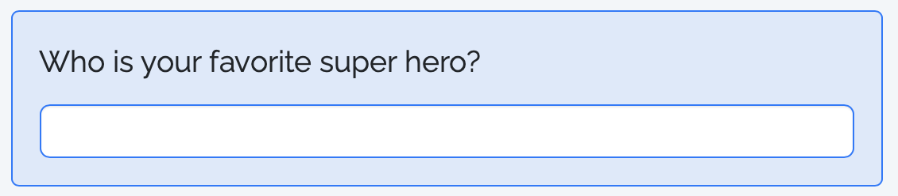{width=100%}
:::

## Question Type: `mc_buttons` {.light-centered .center}

<br>

::: {.column style="width: 48%; font-size: 0.7em; margin-top: -10px;"}

<br>

```{r}
#| results: 'asis'
question_mc_buttons()
```

:::

::: {.column style="width: 4%; font-size: 0.7em; text-align: center;"}

<br>
<br>
<br>
<br>

### -->
:::

::: {.column style="width: 48%; margin-left: -10px; margin-top: -30px;"}
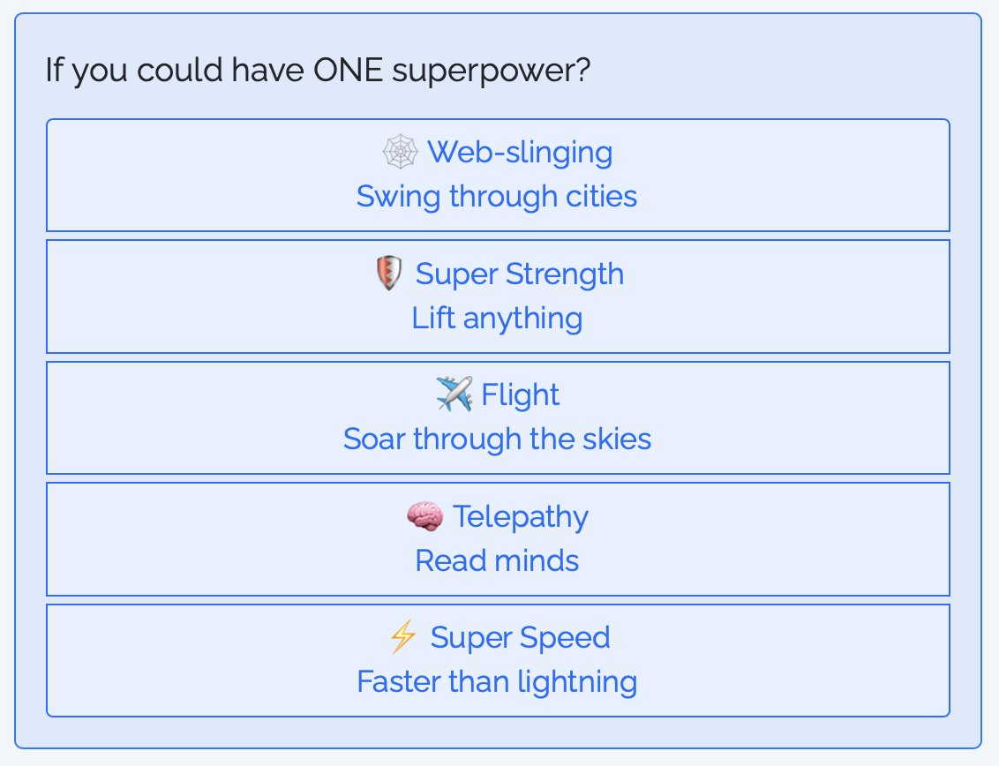{width=100%}
:::

## Conditional logic {.light-centered .center}

<br>

::: {.grid-container style="height: 30vh;"}
::: {.centered-container style="width: 500px;"}
**Conditional showing**
:::

::: {.centered-container style="width: 500px;"}
Conditional skipping
:::

::: {.centered-container style="width: 500px;"}
Conditional stopping
:::
:::

## Conditional showing - `sd_show_if()` {.light-centered .center}

<br>

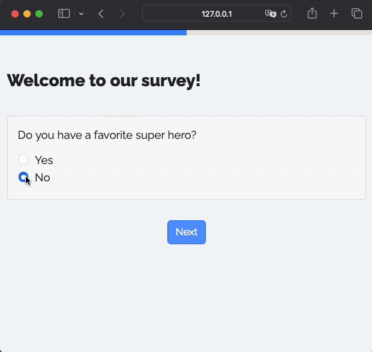{width=50% .purple-border}

## Conditional showing - `sd_show_if()` {.light-centered .center}

<br>

::: {.column style="width: 49%; font-size: 0.7em;"}

### `survey.qmd` {style="text-align: center;"}

```{r}
#| results: 'asis'
show_if_survey()
```

:::

::: {.column width="2%"}
:::

::: {.column .fragment style="width: 49%; font-size: 0.7em;"}

### `app.R` {style="text-align: center;"}

```{r}
#| results: 'asis'
show_if_app()
```

::: {.bubble-top style="text-align: center; display: block; position: relative; left: 0; top: 0; transform: none; margin: 30px auto 0;"}
Condition ~ Target

<br>

"If {condition}, then show {target}"
:::
:::

## If it works in <span style="color: #FFB84D;">Shiny</span>,<br>it works in `surveydown`. {.dark-centered .center style="font-size: 1.2em;"}

## Embedding an interactive map with `leaflet`: {.light-centered .center}

{fig-align="center" width=65%}

## {.dark-centered .center}

::: {.column style="width: 49%;"}
{.purple-border}
:::

::: {.column style="width: 2%;"}
:::

::: {.column style="width: 49%;"}

<br>

### `surveydown` + LLMs<br>is pretty cool {style="font-size: 1.2em;"}
:::

## Generate surveys with LLMs! {.light-centered .center}

{fig-align="center" width=80% .purple-border}

## What's next? {.dark-centered .center style="font-size: 1.2em;"}

## Try out the companion [`sdstudio`](https://github.com/surveydown-dev/sdstudio/) package: {.light-centered .center}

<br>

::: {.centered-container style="width: 500px;"}
`sdstudio::launch()`
:::

## {.light-centered .center}

{fig-align="center" width=100% .purple-border}

## {.light-centered .center}

{fig-align="center" width=100% .purple-border}

## {.light-centered .center}

{fig-align="center" width=100% .purple-border}

## With great power comes great responsibility. {.dark-centered .center style="font-size: 1.2em;"}

## Ways to help: {.light-centered .center}

<br>

::: {.centered-container style="width: 85%;"}
[github.com/surveydown-dev/surveydown/](https://github.com/surveydown-dev/surveydown/)
:::

<br>

::: {.column style="width: 60; text-align: left;"}

- Try it out!
- Give it a ⭐
- Post an issue
- Join the GitHub discussion
- Contribute a template

:::

::: {.column width="40%"}
{fig-align="center" width=70% .purple-border}
:::

## {.dark-centered .center}

::: {.column style="width: 59%; text-align: left;"}

### Meet the team! {style="font-size: 1.5em; text-align: left; padding-left: calc(20%);"}

::: {.img-middle}
[{width="25%" .round-image .purple-border}](https://www.jhelvy.com) John Helveston, Ph.D.
:::

::: {.img-middle}
[{width="25%" .round-image .purple-border}](https://pingfan.org) Pingfan Hu
:::

::: {.img-middle}
[{width="25%" .round-image .purple-border}](https://www.linkedin.com/in/bogdanbt/) Bogdan Bunea
:::

:::

::: {.column width="2%"}
:::

::: {.column width="39%"}

::: {.centered-container style="width: 80%;"}
[**surveydown.org**](https://surveydown.org)
:::

<br>
<br>

{fig-align="center" width=80% .purple-border}

:::

## One more thing... {.dark-centered .center style="font-size: 1.2em;"}

## Workshop by Dr. John Helveston Tomorrow {.light-centered .center}

<br>
<br>

::: {.centered-container style="width: 85%;"}
[jhelvy.github.io/2025-qux-surveydown-workshop/](https://jhelvy.github.io/2025-qux-surveydown-workshop/)
:::

<br>

Thursday Nov 6, **2:00 PM** UTC−5, Eastern Time (U.S.)
